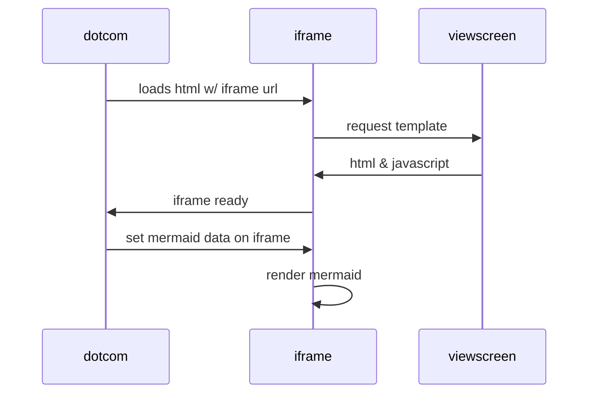

# Backup ONTAP Select Deploy Configuration Data

### Description
This is an Ansible playbook and set of tasks to generate and download a configuration backup of the ONTAP 9 Select Deploy data. It uses the REST API to invoke a backup with an automatically generated name, retrieve the file download link, download the file, and optionally delete the backup on the Deploy server.

### Disclaimer
The playbook and associated components are provided as-is and are intended to provide an example of utilizing the ONTAP collection in Ansible. Fully test in a non-production enviornment before implementing. Feel free to utilize/modify any portion of code for your specific needs.

### Requirements
* ONTAP Select 9.6 Deploy or later
* Ansible 2.9.7 or later
* This playbook - copied to the desired location
* Account running playbook requires write permissions (to create a directory for the downloaded backup)

### Dev/Test Environment
* CentOS 8.1
* Ansible 2.9.7
* ONTAP Select v9.7

### Usage
* Edit the playbook and set the following vars to match your environment:
<pre>
  vars:
    - deploy_login: "admin"
    - deploy_pw: "Netapp1!"
    - deploy_url: "https://192.168.43.190/api/v3"
    - deploy_backup_pw: "{{ deploy_pw }}"
    - deploy_backup_dir: "{{ playbook_dir }}/backups/"
    - deploy_delete_backup: "DELETE"
</pre>

* Example: **ansible-playbook pb_select_deploy_backup"**

### Workflow
1. Generate a backup with internally generated name
2. Monitor the backup job until success or failure - exit on failure
3. Retrieve download URL for the generated backup file
4. Create backup directory if it does not exist (account requires write permissions)
5. Download backup file
6. Optional: Delete the backup file on the Deploy server

